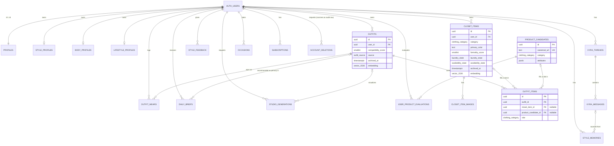

# 04. Data Model

This document explains the Postgres schema in `supabase/migrations/`: the
entity-relationship shape, the reasoning behind decisions that aren't obvious
from the DDL alone, the vector dimension choice, how the §10 Wardrobe Graph
maps onto plain relational tables (per ADR 0003), the query patterns behind
each index, and what changes once the app is past ~10k users.

It assumes familiarity with `docs/00-master-spec.md` §9 (Data Model), §10
(Wardrobe Graph), §14 (API/Edge Functions), and §15 (Supabase Security), and
with `docs/adr/0002-supabase-as-backend.md` / `0003-relational-wardrobe-graph.md`.

---

## 1. Entity-relationship overview



Notes on reading this diagram:

- `AUTH_USERS` is Supabase Auth's table, outside this project's migrations;
  every `owns`/`has`/`plans` edge from it is a `user_id uuid references
  auth.users(id) on delete cascade` foreign key.
- `PROFILES` is `||--||` (exactly one, both directions) because
  `profiles.id` *is* `auth.users.id` — see §2.1.
- `STYLE_PROFILES`, `BODY_PROFILES`, `LIFESTYLE_PROFILES` are `||--o|`
  (zero-or-one) because they're created during onboarding, not at signup —
  a brand-new user has an `auth.users` row and a `profiles` row before they
  have a style/body/lifestyle profile.
- `OUTFIT_ITEMS` is the materialized `pairs_with`/`unlocks` edge from §10's
  Wardrobe Graph — see §4 below.
- `PRODUCT_CANDIDATES` has no edge from `AUTH_USERS`: it's shared reference
  data, not user-owned (see §2.6).

---

## 2. Reasoning behind non-obvious modeling decisions

### 2.1 `profiles.id` is `auth.users.id`, not an independently generated UUID

Every other table in this schema has a UUID primary key defaulting to
`gen_random_uuid()` plus a separate `user_id` foreign key. `profiles` is the
deliberate exception: its primary key *is* the foreign key
(`id uuid primary key references auth.users(id) on delete cascade`, no
default). This is the standard Supabase 1:1-profile pattern, and it's
required by how the row gets created: `handle_new_user()` fires `after
insert on auth.users` and inserts `id = new.id`. If `profiles.id` had its own
`gen_random_uuid()` default, the row's own id would never equal the auth
user's id, breaking the 1:1 relationship the RLS policy
(`id = (select auth.uid())`) depends on.

### 2.2 Denormalized `user_id` on child tables, populated by trigger

`closet_item_images`, `outfit_items`, and `kyra_messages` are not literally
listed with a `user_id` column in §9, but they are unambiguously user-owned
data (an image belongs to whoever owns the closet item; a message belongs to
whoever owns the thread). Rather than expressing their RLS policy as an
`exists (select 1 from parent_table where parent_table.id = child.parent_id
and parent_table.user_id = (select auth.uid()))` subquery — which requires a
join for every row check — each of these tables carries its own `user_id`
column, populated by a `before insert` trigger that reads it from the parent.

This has a security property beyond convenience, verified in manual testing
(§7 below): the trigger functions are plain `SECURITY INVOKER` (not
`SECURITY DEFINER`), so their own lookup against the parent table is itself
subject to that parent table's RLS as the calling user. If a user tries to
insert a `closet_item_images` row against a `closet_item_id` they don't own,
the trigger's `select user_id into new.user_id from closet_items where id =
...` sees zero rows (RLS hides it), `new.user_id` stays `null`, and the
trigger raises immediately — before the outer table's own RLS `WITH CHECK`
even runs. The insert fails at "closet_item_id does not reference an existing
closet item," which is arguably a *better* failure mode for a client to
handle than a bare RLS violation, and it fails for the right reason: the
caller doesn't own that row.

### 2.3 Polymorphic `style_feedback.target_id` — no foreign key

`style_feedback.target_type` can be `closet_item`, `outfit`, `outfit_item`,
or `product_candidate`, and `target_id` points into whichever table
`target_type` names. Postgres has no native polymorphic foreign key (a single
column can't conditionally reference different tables). Three ways to solve
this were considered:

1. **No FK, validated at the application layer** (what's implemented). Simple
   schema, zero migration cost when a new feedback target type is added, but
   the database cannot itself guarantee `target_id` refers to a real row —
   Edge Functions must validate it before insert.
2. **Four nullable FK columns** (`closet_item_id`, `outfit_id`,
   `outfit_item_id`, `product_candidate_id`), one non-null per row via a
   check constraint, mirroring the `outfit_items` exactly-one-of pattern.
   Real referential integrity, but a wide, mostly-null table that needs a new
   column (and a migration) every time a new feedback target type is added —
   feedback targets are the most likely of this schema's polymorphic
   relationships to grow (Discover content, Style Studio results, etc.).
3. **A generic `feedback_targets` join/lookup table.** Adds a layer of
   indirection for a table that's fundamentally simple.

Option 1 was chosen because `style_feedback` is high-write, low-criticality
(losing referential integrity on a stray feedback row is much cheaper than on
a `closet_items`/`outfit_items` row), and because the target vocabulary is
expected to grow as Kyra's surface area grows (§6.20, §6.21). This is a
genuine trade-off, not an oversight — flagged here per project convention for
documenting deliberate trade-offs rather than leaving them silent.

### 2.4 `outfit_items` exactly-one-of `closet_item_id` / `product_candidate_id`

An outfit slot is either something the user owns (`closet_item_id`) or a
"missing item" / shop-the-look slot pointing at the product catalog
(`product_candidate_id`, §6.18 "Complete this look"). Enforced with:

```sql
constraint outfit_items_exactly_one_item check (
  num_nonnulls(closet_item_id, product_candidate_id) = 1
)
```

Both foreign keys are `on delete set null` rather than `cascade`: if a
closet item is deleted, the outfit it was part of shouldn't silently lose a
row (and become malformed with respect to the exactly-one-of invariant if
`product_candidate_id` was also null) — application code decides whether that
slot becomes a "missing item" prompt or the outfit gets flagged for review.
This is why the FK is `set null`, not `cascade`, on this specific relationship
even though every `user_id` FK in the schema is `cascade`.

### 2.5 Soft delete is applied selectively, not blanket

Only three tables have a nullable `archived_at`/`deleted_at`:

- **`closet_items.archived_at`** — explicit in §9, and the §6.15 "Archive"
  action needs it directly.
- **`outfits.archived_at`** — not literal in §9, added because `outfit_wears`
  references `outfit_id`; a hard delete would either cascade-destroy wear
  history (breaking cost-per-wear and Style Journey analytics, §6.22/§6.23)
  or require `on delete set null` on `outfit_wears.outfit_id`, silently
  orphaning history rows with no way back to the outfit they belonged to.
  There's no explicit "delete outfit" action in §6.12/§6.13, but *some*
  mechanism to retire an outfit from active lists has to exist.
- **`studio_generations.deleted_at`** — required by §6.17 ("Provide deletion
  controls") and §13 ("Delete abandoned source images after configurable
  retention"). It's a *pending-purge* marker: an Edge Function/scheduled job
  removes the Storage objects first, then hard-deletes the row, rather than
  leaving generated imagery indefinitely soft-deleted in the database.

**`style_memories` is explicitly hard-delete only — no `archived_at` at
all.** §6.20 frames memory removal as "delete," and §29 frames the broader
privacy posture as opt-out-by-default on training and explicit deletion
rights. A soft-delete flag would leave an inferred personal preference
sitting in the database against that stated intent. Every other table (auth
identity aside) is removed via ordinary `on delete cascade` when the parent
user is removed — no soft delete needed because there's no "hide, but keep
querying against it" use case for, say, an `occasions` or `daily_briefs` row.

### 2.6 `product_candidates` has no `user_id` — it's shared, not user-owned

Unlike every other table, `product_candidates` is a de-duplicated shared
catalog (§17: curated admin entries, retailer affiliate feeds, or
`POST /products/extract` results from a pasted URL), keyed on a unique
`canonical_url`. Many users' `outfit_items`/`user_product_evaluations` rows
can point at the same product row. It is intentionally exempt from "every
user-owned table gets `user_id`" — it isn't user-owned data, and giving it a
`user_id` would either duplicate the row per user (defeating de-duplication
and affiliate-feed caching) or attribute the row to whichever user happened
to trigger its creation, which is meaningless for a shared catalog entry. Its
RLS policy reflects this: read access for all authenticated users, write
access for service-role only (see `20260728100900_rls_policies.sql`).

### 2.7 `user_product_evaluations` keeps history instead of one row per pair

§9 lists this table with no primary key or uniqueness constraint. A
`unique(user_id, product_candidate_id)` constraint (upsert-on-recompute) was
considered and rejected: a user's evaluation of a product legitimately
changes as their wardrobe changes (buying a new item can raise or lower
`outfits_unlocked`/`redundancy_score` for a previously-evaluated product),
and keeping history lets Kyra say "this used to unlock 4 outfits, now unlocks
11" and lets product analytics track verdict accuracy over time. The table
instead has a surrogate `id` and callers fetch the latest row via
`order by created_at desc limit 1`, backed by the composite index
`idx_user_product_evaluations_user_product_created`.

### 2.8 `subscriptions` is current-state, not an event log

One row per `app_store_original_transaction_id` (Apple's durable subscription
identity across renewals), upserted by `POST /subscriptions/sync` and the App
Store webhook (§14). This matches §9's flat table shape and how the client
actually needs to read entitlement ("what is my subscription status right
now"), not "show me every renewal event." If a renewal/refund audit trail is
needed later, it's a new `subscription_events` table, not a reshape of this
one — see §6 for how that fits the scale-out plan.

### 2.9 Canonical units, independent of display preference

`profiles.units` (`imperial`/`metric`) and `outfits.weather_min_celsius` /
`weather_max_celsius` illustrate a general rule applied throughout: numeric
measurements are stored in one canonical unit (metric for body measurements,
Celsius for temperature) regardless of the user's *display* preference, which
lives only in `profiles.units` and is a client-side formatting concern. This
avoids a schema where a `height_value` column's unit depends on a row in a
different table, which would make every query touching it ambiguous without
a join.

### 2.10 Score vs. confidence vs. rating — three numeric conventions, not one

Documented in full at the top of `20260728100200_profiles_and_identity.sql`
and repeated here because it's easy to violate by accident in future
migrations:

| Convention | Type | Range | Example |
|---|---|---|---|
| `*_score` columns | `smallint` | 0–100 inclusive | `compatibility_score`, `formality_score`, `redundancy_score` |
| confidence/probability | `numeric(3,2)` | 0.00–1.00 inclusive | `style_memories.confidence` |
| subjective rating | `smallint` | 1–5 | `outfit_wears.rating` |

The 0–100 integer convention matches §10's "Compatibility score 0–100" and
§26's `compatibilityScore: Int` exactly; deviating from it anywhere would
force the API/client layer to carry per-column scale metadata.

### 2.11 Additions beyond the literal §9 table/column list

A few fields exist because a functional requirement elsewhere in the spec
needs somewhere to live, even though §9's per-table field lists (which read
as illustrative, not exhaustive — none of them include the table's own `id`)
don't mention them:

- `style_profiles.style_goals` (jsonb) — §6.4's onboarding multi-select.
- `body_profiles.appearance` (jsonb catch-all) — §6.7's optional appearance
  fields (skin undertone, hair/eye color, facial hair, glasses, tattoo
  visibility, reference selfie storage paths). Folded into one jsonb column
  rather than six nullable columns because every field is optional and
  explicitly user-omittable by design ("allow omission," §6.7), and none of
  them are independently queried/filtered elsewhere in the spec.
- `account_deletions` (whole table) — required to implement §15's "use a
  deletion job with user-visible status if immediate deletion cannot
  complete synchronously," which §9 doesn't model at all. See §5 below and
  `20260728101300_account_deletion.sql`'s header comment for the full
  orchestration this table supports.

`analytics_events` from §9 was deliberately **not** created — §9's own text
for that entry says "prefer external analytics SDK... do not expose
sensitive images or free-text prompts," which reads as spec guidance against
a heavy first-party events table, not a request for one. If first-party event
storage is added later, it should be a narrow, explicitly-non-sensitive
table, designed against whatever the chosen analytics SDK doesn't already
cover — not a speculative table added now with no concrete consumer.

---

## 3. Vector dimension choice

Every embedding column (`style_profiles.embedding`, `closet_items.embedding`,
`outfits.embedding`, `style_memories.embedding`) is `vector(1536)`.

**Why 1536:** it's the dimensionality of OpenAI's `text-embedding-3-small`
and `text-embedding-ada-002`, which makes it the most common "default"
embedding size in production use today — the goal is a dimension any
`EmbeddingProvider` implementation (§8, ADR 0004) is likely to either produce
natively or be able to project into without a quality-destroying
truncation/padding hack. 1536 dimensions is also comfortably within pgvector
HNSW's practical range (pgvector supports up to 2000 dimensions for indexed
`vector` columns as of the version pinned here), so there's no indexing
workaround needed (no dimensionality reduction, no splitting into multiple
indexed sub-vectors).

**Why this matters and can't be casually changed later:** `vector(N)` is a
fixed-width Postgres type. Changing `N` — even just going from 1536 to a
different provider's native 3072, or down to a cheaper 768 — is `alter table
... alter column embedding type vector(new_n)`, which is a full table
rewrite, and every existing stored vector becomes invalid (a 1536-length
vector cannot be reinterpreted as a 768-length one; it must be regenerated
from source). Concretely, changing the dimension later means: a migration
that rewrites four tables (two of which, `closet_items` and `outfits`, are
expected to be the largest tables in the schema by row count), a full
re-embedding backfill job calling the `EmbeddingProvider` for every existing
row, and a period where either search quality degrades (mixed old/new
vectors, if the migration is done incrementally with a nullable new column)
or embedding-dependent features are unavailable (if done as a hard cutover).
This is why the column comment in every migration that declares a vector
column repeats this warning rather than assuming it's understood once.

**Alternative considered:** a smaller dimension (768, matching several
open-weight embedding models) would cut storage and HNSW index size roughly
in half and speed up index builds, which matters more as `closet_items` and
`outfits` grow into the hundreds-of-thousands-of-rows range (§6 below). This
was not chosen for v1 because provider flexibility (ADR 0004's explicit "do
not hardcode to one model vendor") is a stronger near-term constraint than
storage efficiency at MVP scale — 1536 is the dimension most candidate
providers can produce directly, minimizing the chance the very first
provider swap also has to be a schema migration.

---

## 4. Wardrobe Graph → relational tables

ADR 0003 already makes the top-level call (relational + computed
compatibility, not a graph database) and its trade-offs; this section is the
concrete mapping from §10's node/edge vocabulary onto this schema, since the
spec describes the graph abstractly and the implementation needs to be
traceable back to it.

| §10 concept | Relational representation |
|---|---|
| **Nodes**: User | `auth.users` (+ `profiles`) |
| Closet item | `closet_items` |
| Outfit | `outfits` |
| Occasion | `occasions` |
| Style identity | the `style_identity` enum, referenced from `style_profiles.primary_identity`/`secondary_identities` |
| Product candidate | `product_candidates` |
| Color | `closet_items.primary_color`/`secondary_colors` (free text/jsonb, not a normalized `colors` table — see below) |
| Season | `closet_items.seasonality` (jsonb array) |
| Brand | `closet_items.brand` / `product_candidates.brand` (free text, not normalized) |
| Fit characteristic | the `fit_preference` enum + `body_profiles.fit_notes` (jsonb) |
| **Edges**: `pairs_with` | An `outfit_items` row: two items appearing in the same `outfit_id` *is* the pairing. There's no separate edge table — this is ADR 0003's "materialized as ordinary foreign-keyed rows" case. |
| `unlocks` | Not stored as an edge at all — computed on demand by `POST /products/evaluate` (§14) into `user_product_evaluations.outfits_unlocked`, following the §10 "generate combinations, filter, count, cache" algorithm. The *cached result* is the only persisted trace of this edge. |
| `conflicts_with` | Not stored; computed at scoring time from the §10 weighted formula (a low color/formality/silhouette compatibility score between two items *is* a soft "conflicts" signal — there's no boolean edge, only a graded one). |
| `worn_in` | `outfit_wears` (an outfit worn at a point in time) joined through `outfit_items` back to the specific closet items involved. |
| `preferred_with` | Derived from `style_feedback` history (the "historical co-wear/feedback" 10% term in the §10 formula) — not a standing edge, a signal folded into the score. |
| `replaces` | Not modeled explicitly in v1; a candidate for a future `closet_items.replaces_item_id` self-reference if/when the "replacement suggestion" feature (§6.15) needs a persisted link rather than a computed suggestion. |
| `duplicates` | Computed at query time via `closet_items.embedding` similarity (cosine distance under a threshold, HNSW-indexed) plus matching `category`/`primary_color` — not a stored edge, because "is this a duplicate" is a graded, threshold-dependent judgment that can change as the threshold is tuned, and persisting it would mean re-deriving/invalidating a stored boolean every time the threshold config changes. |
| `suited_for` | `occasions.dress_code` matched against `outfits.formality_score`/`occasion_tags` at read time; also the `dress_code`/`style_identity` enums shared between `lifestyle_profiles`, `occasions`, and `style_profiles`. |
| `owned_by` | The `user_id` foreign key on `closet_items` (and everywhere else) *is* this edge — the most literal possible relational mapping. |

**Why `Color`/`Brand` aren't normalized tables:** a `colors` or `brands` table
with foreign keys from `closet_items` would be the more "textbook" relational
design, and would be worth it if the product needed brand-level analytics
across users (e.g. "which brands do quiet-luxury users own most") or
canonical color deduplication ("Navy" vs "Midnight Blue" resolving to one
entity) as a first-class feature. Neither is in MVP scope (§23). Free text
(`brand`) plus a jsonb array (`secondary_colors`) is cheaper to build against
and doesn't block adding normalization later — a `brands` table can be
introduced and backfilled from the existing free-text values without a
breaking change to `closet_items`, whereas normalizing prematurely would add
join overhead to the single highest-traffic table in the schema for a
capability nothing in the MVP scope actually needs yet.

**Cache invalidation, named as a real cost (per ADR 0003):** `outfits.
compatibility_score` and `user_product_evaluations.*_score` are caches, not
live-computed values. Anything that changes an input to the §10 weighted
formula — archiving a `closet_items` row, editing its `formality_score` or
`primary_color`, a new `style_feedback` row, a change to the server-side
compatibility weights config — invalidates every cached score that formula
term depended on. This schema does not implement automatic invalidation (no
trigger recomputes `outfits.compatibility_score` when a referenced
`closet_items` row changes); that recomputation is intentionally left to the
Edge Function layer (`POST /outfits/rank`, `POST /products/evaluate`), which
is where the weighted-formula logic itself lives per ADR 0003 ("weights
should be configurable server-side"). A database trigger could force
recomputation on every edit, but would either duplicate the scoring formula
in SQL (violating "configurable server-side" by hardcoding weights into a
trigger function) or make every `closet_items` update pay the cost of
synchronously recomputing every outfit that references it, which does not
scale with closet size. This is a deliberate boundary, not a gap.

---

## 5. Account deletion as an async job

`account_deletions` (§9's model has no equivalent) exists because §15
explicitly permits — and this schema needs — an async deletion job: deleting
the `auth.users` row (which cascades through every `on delete cascade`
`user_id` foreign key) requires the GoTrue Admin API, which is not callable
from SQL, and deleting the actual Storage *blobs* (not just their
`storage.objects` metadata rows) requires the Storage API, also not callable
from SQL. See the full six-step orchestration comment at the top of
`20260728101300_account_deletion.sql` for the exact sequence an Edge Function
must run. The short version: `request_account_deletion()` (user-callable)
creates a `pending` row and returns immediately so the client can show
progress; the Edge Function then does the Storage API blob deletion, calls
`finalize_account_deletion()` (service-role only) for defense-in-depth
metadata cleanup and to record a one-way `sha256` hash of the user id before
it's gone, calls the GoTrue Admin API to delete the `auth.users` row (which
cascades everything else away), and finally calls
`mark_account_deletion_complete()`.

---

## 6. Query patterns each index serves

Every index in `20260728101100_indexes_and_search.sql` maps to a named
product query. The non-obvious ones:

- **`idx_closet_items_user_category_active` / `..._availability_active`**
  (partial, `where archived_at is null`): the closet grid's category tiles
  (§6.14) and outfit generation's "what's actually wearable right now" filter
  (§5.4 step 2) are the two highest-frequency closet reads, and both need to
  exclude archived items. A partial index keeps the index small as a power
  user accumulates archived history over years of use, instead of growing
  proportionally with total lifetime items.
- **`idx_outfit_wears_outfit_id_worn_at` / `..._user_id_worn_at`** (both
  `desc`): wear history is always read most-recent-first — the item detail
  "last worn" / wear timeline (§6.15) and the Style Journey timeline
  (§6.22/§6.23) both scan backward from now.
- **GIN `jsonb_path_ops` indexes** (`seasonality`, `secondary_colors`,
  `occasion_tags`, `attributes`): every one of these columns is filtered by
  containment (`@>` — "does this item's seasonality include winter") per the
  §6.14 filter list, never by key existence or JSON path queries, so the
  smaller/faster `jsonb_path_ops` operator class is used instead of the
  default `jsonb_ops`.
- **Trigram (`pg_trgm`) indexes on `name`/`brand`**: the closet and product
  search bars (§6.14, §6.19/§6.21) are "starts typing, wants live fuzzy
  results," which a plain btree can't serve efficiently for substring/typo-
  tolerant matches.
- **HNSW indexes, all partial (`where embedding is not null`)**: embeddings
  are populated asynchronously (server-side, after the CV/embedding pipeline
  runs, §12) — a freshly-scanned item has a row before it has an embedding.
  Excluding nulls keeps the index from being built over rows that can never
  usefully be searched, and keeps it smaller as the always-nonzero fraction
  of not-yet-embedded rows grows during any embedding-provider migration.
- **`idx_user_product_evaluations_user_product_created`**: serves the
  "latest evaluation for this user+product" read pattern from §2.7's
  history-preserving design — `order by created_at desc limit 1` against
  this composite index avoids a sort at query time.

---

## 7. Verification performed

A local Postgres 16 + pgvector 0.6.0 instance (apt packages
`postgresql-16`, `postgresql-16-pgvector`) was used, with a small SQL shim
(not part of the deliverables) standing in for the parts of a real Supabase
project that exist before any user migration runs: the `auth`/`storage`
schemas and their tables/functions, the `authenticated`/`anon`/`service_role`
roles, RLS already enabled on `storage.objects`/`storage.buckets`, and the
platform's default-privilege grants on the `public`/`extensions` schemas.

All 14 migrations were applied in order against a clean database (zero
errors), then the entire set was re-applied a second time against the
already-migrated database to confirm idempotency (zero errors, all `create
... if not exists` / `do $$ ... exception when duplicate_object` / policy-
existence guards worked as intended).

Functional checks performed on top of the applied schema, beyond "it
compiles":

- `handle_new_user()` creates a `profiles` row on `auth.users` insert.
- The `outfit_items_exactly_one_item` check constraint rejects both the
  both-null and both-non-null cases and accepts exactly-one-set.
- RLS blocks a user from inserting a row claiming another user's `user_id`
  (tested directly against `closet_items`).
- The denormalized-`user_id` trigger family, combined with RLS, blocks a
  user from attaching a `closet_item_images` row to another user's
  `closet_items` row — and does so at the trigger's own existence check
  (see §2.2), not just at the outer RLS policy.
- `bump_closet_item_wear_stats()` correctly increments `wear_count` and
  advances `last_worn_at` on `outfit_wears` insert.
- `vector(1536)` rejects a wrongly-dimensioned value at write time
  (`expected 1536 dimensions, not 3`).
- `product_candidates` is readable by any authenticated user and rejects
  direct writes from the `authenticated` role (service-role-only, per
  §2.6).
- The full six-step account-deletion sequence (§5) was run end to end:
  `request_account_deletion()` → simulated Storage object → `finalize_
  account_deletion()` (confirmed it purges the simulated storage object and
  records `user_id_hash`) → deleting the `auth.users` row directly (standing
  in for the GoTrue Admin API call) → confirmed cascade deletion of that
  user's `closet_items`/`profiles` rows while a second user's data was
  unaffected → confirmed the `account_deletions` audit row survived with
  `user_id` nulled and `user_id_hash` retained → `mark_account_deletion_
  complete()`.
- Storage RLS policies (`storage.objects`, keyed on `(storage.foldername
  (name))[1] = 'users'` / `[2] = auth.uid()`) were confirmed to allow a user
  to write under their own `users/{their_id}/...` prefix and reject a write
  under a different user's prefix.
- **A real bug found and fixed during this verification**: Supabase's
  platform grants `EXECUTE` on every newly created `public`-schema function
  to `anon`/`authenticated` by default (a documented Supabase default-
  privilege behavior). The service-role-only functions
  (`finalize_account_deletion`, `mark_account_deletion_complete`, `mark_
  account_deletion_failed`, `handle_new_user`) originally only did `revoke
  all ... from public`, which does **not** revoke a grant made directly to
  `anon`/`authenticated` by that default-privilege mechanism — `authenticated`
  could still call `finalize_account_deletion()` (it failed on "not found,"
  not on a permission error, meaning the call was actually executing).
  Fixed by revoking explicitly from `public, anon, authenticated` before
  granting to the intended role. Re-verified: `authenticated` now gets
  `permission denied for function finalize_account_deletion`, as intended.

This means the schema was execution-tested, not just syntax-checked: every
constraint, trigger, and policy claimed in the migration comments was
exercised against a running Postgres instance and produced the documented
behavior.

---

## 8. What changes past ~10k users

Scoped to what this data model specifically needs to revisit — not a general
scaling essay.

- **Compatibility/evaluation score caching gets a real invalidation
  mechanism.** At MVP scale, stale cached scores (§4, "cache invalidation")
  are a tolerable, rare annoyance. Past 10k users with real wardrobes (the
  ADR 0003 "conditions to revisit" reference 300+ item power-user closets),
  recomputing on every read becomes too slow and never-invalidating becomes
  visibly wrong often enough to matter. This likely means either a job queue
  (recompute affected outfits/evaluations asynchronously after a closet edit,
  not synchronously in the request path) or a dependency-tracked cache
  (store which `closet_items` ids a given cached score depended on, and
  invalidate precisely instead of by TTL).
- **HNSW index build/maintenance cost.** `closet_items` and `outfits` are the
  two tables most likely to reach hundreds of thousands to low millions of
  rows first. HNSW index build time and memory (`maintenance_work_mem`) scale
  with row count; past 10k active users this needs actual measurement against
  production-shaped data, and the default `m`/`ef_construction` parameters
  used here (pgvector defaults, §12 of `indexes_and_search.sql`) should be
  revisited against real recall/latency numbers rather than left as an
  unexamined default.
- **`user_product_evaluations` history growth.** §2.7's deliberate choice to
  keep evaluation history has an unbounded-growth cost: a user who
  repeatedly re-checks the same product (common for anything near a purchase
  decision) accumulates rows indefinitely. A retention policy (e.g. keep the
  latest N per user+product, or collapse history older than a threshold into
  a summary) becomes necessary once this is observed in production, not
  before — no such policy is implemented now because there's no real usage
  data yet to size it against.
- **`style_feedback.target_id` polymorphism (§2.3) should be revisited if the
  target vocabulary keeps growing.** The no-FK trade-off was chosen because
  the vocabulary was small (4 types) and DB-level referential integrity on
  this specific table was judged non-critical. If Discover content,
  Style Studio generations, or other future entities become common feedback
  targets, moving to a table-per-target-type or a validated-by-trigger
  approach becomes worth the added complexity.
- **`subscriptions` becoming an event log.** If renewal/refund audit history
  is ever needed (chargeback disputes, LTV analysis by cohort), the
  current-state design in §2.8 needs a companion append-only
  `subscription_events` table rather than a reshape of `subscriptions`
  itself, which the client and webhook handler depend on staying a simple
  current-state lookup.
- **Read replicas / connection pooling** become an operational (not schema)
  concern past this scale, but do interact with this schema in one way: the
  `(select auth.uid())` subquery form used in every RLS policy (per project
  convention, for the InitPlan optimization) should be re-benchmarked under
  real concurrent load once there's traffic to benchmark against — the
  Postgres planner behavior this relies on is version-dependent, and Supabase
  project Postgres versions do change over time.
- **Partitioning is explicitly not needed yet and shouldn't be added
  speculatively.** `outfit_wears`, `kyra_messages`, and `daily_briefs` are the
  three tables with the most naturally time-ordered, ever-growing write
  pattern (candidates for time-range partitioning if they ever become
  multi-hundred-million-row tables). At 10k users, none of these tables are
  remotely close to a size where partitioning's operational overhead
  (constraint exclusion, partition maintenance jobs, cross-partition query
  planning quirks) pays for itself — this is called out only so a future
  reader knows it was considered and consciously deferred, not missed.

---

## 9. Ambiguities resolved

Places where §9/§10/§15 didn't fully specify something and a concrete
decision had to be made (also called out inline in the relevant migration's
comments):

1. **`availability_state` value set.** §9 lists both `laundry_state` and
   `availability_state` as separate columns on `closet_items` without
   defining `availability_state`'s values. Interpreted `availability_state`
   as the broader "can this be selected into an outfit right now" gate
   (covering alteration, travel packing, loans, and loss — not just the wash
   cycle), distinct from the narrower `laundry_state`.
2. **`condition` and `dress_code` value sets.** Neither is enumerated in the
   spec. `condition` uses a standard five-point menswear-resale-style scale
   (`new_with_tags` → `worn`); `dress_code` uses a standard eight-rung
   menswear formality ladder (`ultra_casual` → `black_tie`/`formal`, plus
   `athletic`).
3. **Storage bucket layout: one bucket vs. three.** §15 writes the path
   convention as `users/{user_id}/closet/...`, `users/{user_id}/
   references/...`, `users/{user_id}/studio/...` — a shared `users/{user_id}/`
   prefix with feature subfolders. This was read as describing **one**
   private bucket (`user-content`) with subfolders, not three independent
   per-feature buckets each rooted at `{user_id}/...`. The alternative (three
   buckets) was considered and rejected because the spec's literal path
   strings all start with the same `users/` segment, which only makes sense
   as a shared bucket root; three separate buckets would each redundantly
   need their own `{user_id}/` root, and every consumer (Storage RLS
   policies, signed URL generation, the account-deletion purge step) would
   need to iterate three buckets instead of one prefix.
4. **`laundry_cadence` and a few other lifestyle fields left as free text.**
   §6.8 lists "laundry cadence," "travel frequency," etc. as profile inputs
   without enumerating fixed value sets, and their natural phrasing ("twice
   a week," "whenever I run out") doesn't obviously collapse into a small
   closed enum. Left as free text rather than guessing at a value set the
   spec doesn't provide, with the enum-vs-text trade-off documented at the
   column.
5. **`analytics_events` omitted.** §9 mentions it but its own text
   recommends against a heavy first-party table ("prefer external analytics
   SDK"); no table was created for it. See §2.11.
